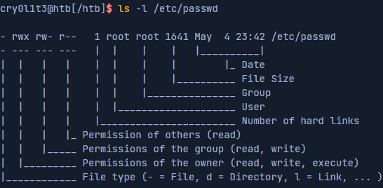
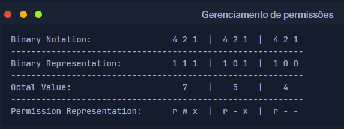

# Gerenciamento de permissões

No linux, as permissões são atribuídas a usuários e grupos. Cada usuário pode ser membro de grupos diferentes, e a associação a esses grupos fornece ao usuário permissões adicionais especifícas. Cada arquivo e diretório pertence a um usuário específico e a um grupo específico. Assim as permissõespara usuários e grupos que definiriam um arquivo também são definidas para os respectivosproprietários. Quando criamos novos arquivos ou diretórios, eles pertencem ao grupo ao qual pertencemos e a nós.

Quando um usuário deseja acessar o conteúdo de um diretório linux, ele deve primeiro percorrer o diretório, o que significa navegar até esse diretório,  exigindo que o usuário tenha permissão de execução no diretório. Sem esta permissão, o usuário não poderá acessar o conteúdo do diretório e, em vez disso, receberá uma mensagem de erro " **Permission Denied**".

É importante observar que na execução são necessárias permissões para percorrer um diretório, independentemente do nível de acesso do usuário. Além disso, as permissões de execução em um diretório não permitem que um usuário execute ou modifique quaisquer arquivos ou conteúdos dentro do diretório, apenas para percorrer e acessar o conteúdo do diretório.

Para executar arquivos dentro do diretório, um usuário precisa de permissões de execução no arquivo correspondente. Para modificar o conteúdo de um diretório (criar, excluir ou renomear arquivos e subdiretórios), o usuário precisa de
permissões de escrita no diretório.

Todo o sistema de permissões em sistemas Linux é baseado no sistema de números octais e, basicamente, existem três tipos diferentes de permissões que podem ser atribuídas a um arquivo ou diretório:

 - ( **r** ) - Ler
 - ( **w** ) - Escrever
 - ( **x** ) - Executar

As permissões podem ser definidas para **owner**, **group** e **others** como apresentado no próximo exemplo com suas permissões correspondentes.

## Alterar permissões

Podemos modificar as permissões usando o comando `chmod`, referências de grupo de permissões ( **u**- proprietário, **g**- Grupo, **o**- outros, **a**- Todos os usuários) e um [ **+**] ou um [ **-**] para adicionar e remover as permissões designadas. No exemplo a seguir, um usuário cria um novo script de shell de propriedade desse usuário, não executável, e definido com permissões de leitura/gravação para todos os usuários.

`ls -l shell`

Podemos então aplicar permissão de leitura para todos os usuários e ver o resultado.

`chmod a+r shell && ls -l shell`

Também podemos definir as permissões de letura para todos os outros usuários usando apenas a tribuição de valor octal.

`chmod 754 shell && ls -l shell`

Vejamos todas as representações a ele para entender melhor como a atribuição de permissão é calculada.

