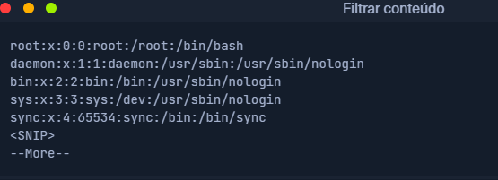
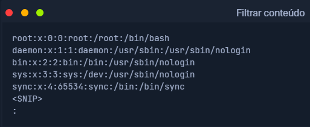
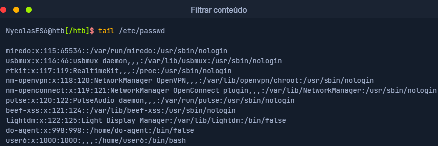
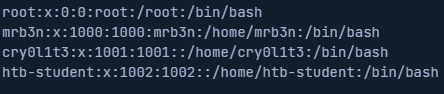
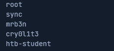
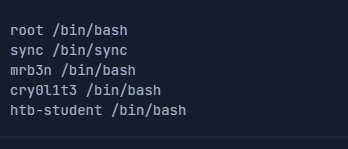
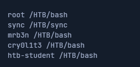

# Filtrar conteúdo

Na última seção, aprendemos sobre os direcionamentos que podemos usar para direcionar os resultados de um programa para outro para processamento. Para ler arquivos, não precisamos necessariamente usar um editor para isso.Existem duas ferramentas chamadas  **more** e **less**, que são muito idênticas. São **pagers** fundamentais que nos permitem percorrer os arquivos de forma interativa.Veja alguns exemplos.

## more

`NycolasES6@htb[/htb]$ more /etc/passwd`

Depois de lermos o conteúdo usando **cat** e redirecionálo para **more**, o já mencionado **pager** abre, e iniciaremos automaticamente no início do arquivo.

Com a chave **[Q]**, podemos deixar isso **pager**. Notaremos que a saída permanece no terminal.

## less

Se agora dermos uma olhada na ferramenta **less**, Notaremos na página que ela comtém muito mais recursos do que o **more**.

`NycolasES6@htb[/htb]$ less /etc/passwd`

A apresentação équase a mesma do **more**.

Ao fechar **less** com a chave **[Q]**, notaremos que a saída é o contrário da do **more**, não perm\nece no terminal.

## head

Ás vezes estaremos interessados apenas em questôes especificas no início ou no final do arquivo. Se quisermos apenas obter as primeiras linhas do arquivo, podemos usa a ferramenta head. Por padrão, head imprime as primeiras dez linhas do arquivo ou entrada fornecido, se não for especificado de outra forma.

## tail

Se quisermos ver apenas as últimas partes de um arquivo ou resultados, podemos usar a contrapartida de head chamando tail, que retorna as lastdez linhas.

## sort

Dependendo de quais resultados e arquivos são tratados, eles raramente são classificados. Muitas vezes é necessário ordenar os resultados desejados em ordem alfabética ou numérica para obter uma melhor visão geral. Para isso, podemos utilizar uma ferramenta chamada **sort**.

Como podemos ver agora, a saída não começa mais com root, mas agora é classificada em ordem alfabética.

## grep

Mais frequentemente, procuraremos apenas resultados específicos que contenham padrões que definimos. Uma das ferramentas mais utilizadas para isso é o ``grep``, que oferece diversos recursos. Assim, podemos procurar usuários que tenham o shell padrão "**/bin/bash**" definido como exemplo.

``NycolasES6@htb[/htb]$ cat /etc/passwd | grep "/bin/bash"``

Outra possibilidade é excluir resultados específicos. Para isso, utiliza-se a opção ``-v`` com ``grep``. No próximo exemplo, excluímos todos os usuários que desabilitaram o shell padrão com o nome " **/bin/false**" ou " **/usr/bin/nologin**".

``NycolasES6@htb[/htb]$ cat /etc/passwd | grep -v "false\|nologin"``

## cut

Resultados específicos com caracteres diferentes podem ser separados como delimitadores. Aqui é útil saber como remover delimitadores específicos e mostrar as palavras em uma linha em uma posição especificada. Uma das ferramentas que podem ser utilizadas para isso é o ``cut``. Portanto usamos a opção "``-d``" e definimos o delimitador para o caractere de dois pontos (``:``) e definimos com a opção "``-f``" a posição na linha que queremos gerar.

`NycolasES6@htb[/htb]$ cat /etc/passwd | grep -v "false\|nologin" | cut -d":" -f1`

## tr

Outra possibilidade de substituir determinados caracteres de uma linha por caracteres definidos por nós é a ferramenta tr. Como primeira opção definimos qual caractere queremos substituir e, como segunda opção, definimos o caracter pelo qual queremos substituí-lo. No próximo exemplo, substituímos o caractere dois pontos por espaço.

`NycolasES6@htb[/htb]$ cat /etc/passwd | grep -v "false\|nologin" | tr ":" " "`!

[alt text](filtrar-conteudo-tr.png)

## column

Como os resultados da pesquisa muitas vezes podem ter uma representação pouco clara, a ferramenta **column** é adequada para exibir esses resultados em formato tabular usando o "**-t**".

`NycolasES6@htb[/htb]$ cat /etc/passwd | grep -v "false\|nologin" | tr ":" " " | column -t`!

[alt text](filtrar-conteudo-column.png)

## awk

Como podemos ter notado, o usuário "**postgres**" tem uma linha a mais. Para manter a classificação de tais resultados o mais simples possível, a programação **(g)awk** é benéfica, que nos permite exibir o primeiro ( **$1**) e o último ( **$NF**) resultado da linha.

`NycolasES6@htb[/htb]$ cat /etc/passwd | grep -v "false\|nologin" | tr ":" " " | awk '{print $1, $NF}'`

## sed

Haverá momentos em que desejaremos alterar nomes específicos em todo o arquivo ou na entrada padrão. Uma das ferramentas que podemos usar para isso é o editor de stream chamado **sed**. Um dos usos mais comuns disso é a substituição de texto. Aqui, **sed** procura padrões que definimos na forma de expressões regulares (**regex**) e os substituímos por outro padrão que também definimos. Vamos nos ater aos últimos resultados e dizer que queremos substituir a palavra " **bin**" por " **HTB**".

O sinalizador "**s**" no início representa o comando substituto. Em seguida, especificamos o padrão que queremos substituir. Após a barra ( **/**), inserimos o padrão que queremos usar como substituto na terceira posição. Por fim, usamos a flag "**g**", que significa substituir todas as correspondências.

``NycolasES6@htb[/htb]$ cat /etc/passwd | grep -v "false\|nologin" | tr ":" " " | awk '{print $1, $NF}' | sed 's/bin/HTB/g'``

